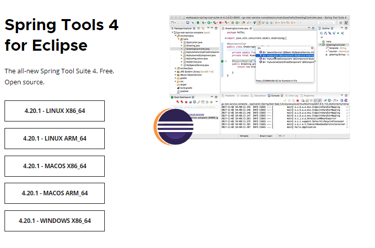
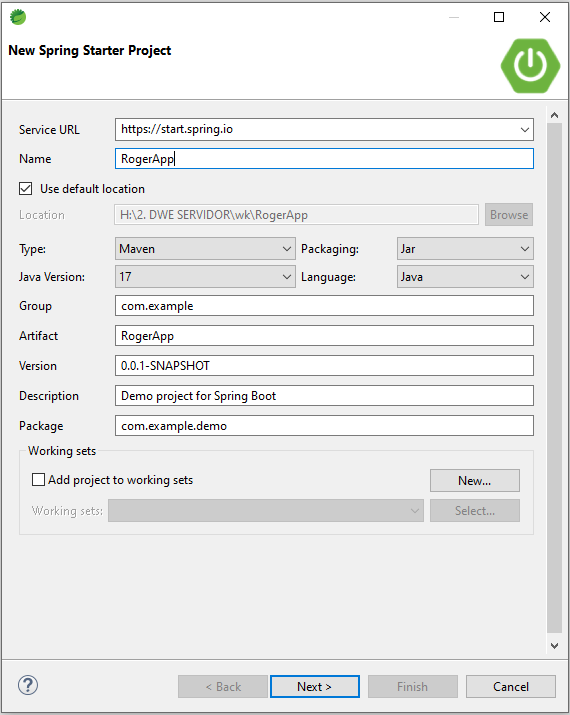
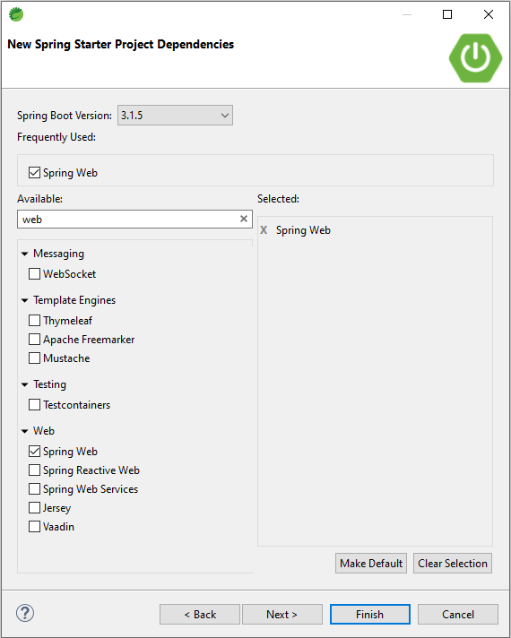
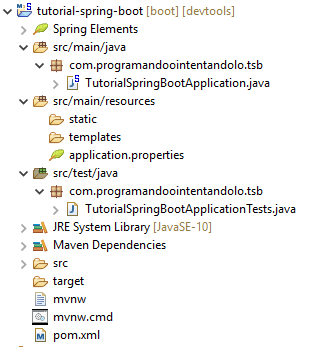
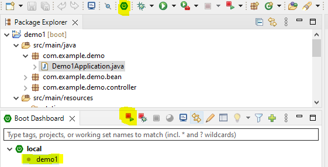
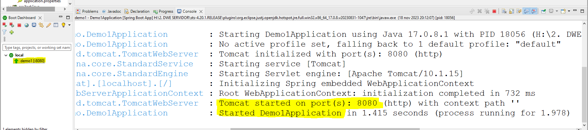

Una aplicación web con Spring boot puede ser desarrollada y ejecutada en cualquiera de los principales IDE's de desarrollo (Code, intellij, NetBeans o Eclipse). Algunos IDE's incluyen tools especificas de Spring para crear proyectos e ejecurlos de una forma visual más sencilla e intuitiva visual, pero como cualquier proyecto con maven, se puede lanzar por consola de comandos(mvn spring-boot:run).

Para este curso se ha elegido la herramienta STS (Spring Tools for Eclipse). Es un eclipse que incluye la herramienta Spring tool. Descarga disponible en [Spring Tool](https://spring.io/tools)

**Spring Initializr**

Por parte de los desarrolladores de Spring, se tiene a disposición una herramienta web online denominada Spring Initializr donde por medio de unos parámetros de configuración genera automáticamente un proyecto Maven o Gradle, según se elija, en un archivo comprimido Zip conteniendo la carpeta con la estructura de la aplicación para ser importada directamente desde el editor de programación como Eclipse IDE, Netbeans IDE o Intellij.

Se puede acceder mediante el enlace a la dirección: https://start.spring.io/

El asistente web solicita una serie de datos necesarios para poder ejecutar la plantilla que construye los primeros archivos del programa. Para todos ellos aporta una configuración por defecto que conviene cambiar, como el nombre de la aplicación, o el package que se usará en las clases generadas.

A continuación se explica qué parámetros hay y para qué sirven:

- Project: Permite elegir la herramienta de construcción de la aplicación. En Java las dos herramientas más usadas son Maven y Gradle. Recomendamos Maven al ser la más expendida.
Language: Lenguaje de programación que se va a utilizar en la aplicación. Los tres tipos están soportados por la máquina virtual JVM. Java es la opción más extendida y tiene mejor soporte de los editores de programación.

- Spring Boot: Versión del Spring Boot a usar. Siempre que se pueda se optará por la última estable, compuesta únicamente por números.
Project Metadata, Group: Se refiere al descriptor de Maven groupId, utilizado para clasificar el proyecto en los repositorios de binarios. Normalmente se suele usar una referencia similar a la de los packages de las clases. Por ejemplo, com.arteco.web para disponer todas las aplicaciones web en el mismo directorio.

- Project Metadata, Artifact: Se refiere al otro descriptor de Maven artifactId, y por tanto para indicar el nombre del proyecto y del binario resultante. La combinación de groupId y artifactId (más la versión) identifican inequívocamente a un binario dentro de cualquier organización.
Packaging: Indica qué tipo de binario se debe construir. Si la aplicación se ejecutará por sí sola se seleccionará JAR, éste contiene todas las dependencias dentro de él y se podrá ejecutar con java -jar binario-.jar. Si por el contrario, la aplicación se ejecutará en un servidor J2EE existente o en un Tomcat ya desplegado se deberá escoger WAR.

- Java: Se selecciona la versión de Java a usar. En este caso, se recomienda usar la versión de Java más antigua para garantizar la compatibilidad con otras librerías o proyectos que se quieran incluir, así será más probable encontrar documentación existente que siga siendo válida. Reduce el riesgo de toparse con funcionalidades no muy maduras.

- Dependencies: Buscador de dependencias con los starters de Spring boot disponibles. Las dependencias más habituales son:

	- Spring Web se deberá escoger cuando se desee hacer una aplicación web o microservicios, siempre que se requiera una comunicación http y por tanto el uso de Spring MVC.
		
	- Thymeleaf Incorpora el motor de plantillas para HTML dinámico, sucesor de los anteriores JSP (Java Server Page).

	- Spring Data JPA necesario para utilizar la capa estándar de acceso a base de datos SQL denominada Java Persistence Api.

	- Spring Security Permite incorporar controles de acceso en base a usuarios y roles sobre URLs de la aplicación. También habilita el control de ejecución de métodos de servicio en base a roles según los estándares J2EE.
	
	- Lombok Aporta utilidades que facilitan la programación como la creación de @Getters y @Setters automáticamente para las clases que forman parte del conjunto de mensajes.
	
	- Mysql/Postgresql Incluye el JAR que contiene el driver JDBC necesario para configurar la capa de JPA según la base de datos a usar.
	
	- Otras… El asistente permite seleccionar entre más de 50 dependencias e integraciones de herramientas open source dentro de los proyectos realizados con Spring.

Una vez seleccionados los parámetros que se quieren, haciendo click en el botón «Generate-Ctrl+» se descargará un archivo zip con el nombre del Artifact que contendrá la carpeta con la estructura de la aplicación lista para importar desde el IDE.

En nuestro caso, se dispone en el IDE sts una utilidad rápida como Spring initializr.

>File > New > Spring Starter Project

En nuestro caso, seleccionamos la dependecencia de Spring Web para poder crear más adelante una API Rest, la pulsar Finish se verá nuestro proyecto generado. 

**Estructura de un proyecto Spring Boot**

El fichero más importante es MyWebAppApplication.java que corresponde con el punto de entrada a la ejecución del programa. Aquí es donde se aloja el método public static void main(String[] arg) que es el que inicializa toda la aplicación de Spring Boot.

Durante el arranque del framework, Spring revista el resto de directorios o paquetes que cuelgan de método main en búsqueda de clases marcadas con alguna anotación que permite el registro de componentes como: @Service, @Component, @Repository y demás anotaciones de Spring y de Spring MVC como @Controller o @RestController. Fíjese que el paquete utilizado es el com.eadp.web, esta opción puede especificarse en el asistente Spring Initializr.

El siguiente fichero más importante es application.properties que es donde se aloja toda la configuración de los componentes de Spring Boot, cómo que encoding usar (utf-8), si debe usar caché en las plantillas, qué nombre y clave de acceso son los de por defecto, etc… En el enlace de configuraciones y propiedades comunes de spring boot hay una referencia de todas las existentes y sus valores iniciales.

El siguiente fichero es MyWebAppApplicationTests.java donde se aloja el primer test de ejemplo que genera Initializr por nosotros. Ahí, el usuario debe añadir los test que considere oportunos para aplicar en la medida de lo posible desarrollo orientado a test o TDD.

Los otros directorios son static que es donde se alojan los recursos estáticos que la aplicación debe servir sin procesar. Por ejemplo en esta carpeta se incluyen los ficheros CSS, Javascript, imágenes o fuentes que se referencian desde el HTML.

Si el fichero alojado en este directorio está en una sub-carpeta de static, como puede ser static/css/main.css. Spring Boot lo publicará automáticamente en la url http://localhost:8080/css/main.css. Así que no debe haber información sensible que cuelgue del directorio static porque entonces será accesible abiertamente.

Y por último la carpeta templates almacena los ficheros que permiten generar HTML dinámicamente con algún motor de plantillas soportado por Spring como Thymeleaf o Freemarker.

**Arranque Aplicación**

Para ejecutar la aplicación generada, basta con ejecutar el fichero XXXAplication.java.
Se puede ejecutar directamente desde la pesteña Boot Dashboard o seleccionado el fichero   y lanzado un run as > Spring boot App

Se puede cambiar el puerto de arranque indicando en el fichero application.properties la siguente propiedad.

>server.port=8085