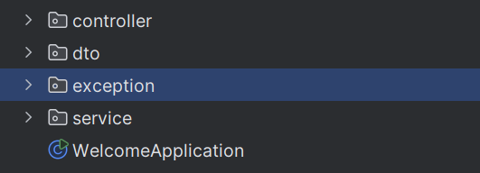

  - [Componentes de Spring Boot](#componentes-de-spring-boot)
    - [Rest Controller](#rest-controller)
    - [Requests](#requests)
            - [Parámetros](#parámetros)
            - [Peticiones con datos serializados](#peticiones-con-datos-serializados)
   - [Patron DTO](#patron-dto)
   - [Service](#service)
   - [Exception](#exception)
   - [Valid](#valid)
   - [Postman](#postman)

## Componentes de Spring Boot
Spring Boot nos ofrece una serie de componentes que nos ayudan a crear aplicaciones web de forma rápida y sencilla. Nuestros componentes principales se etiquetarán con @ para que el framework Spring lo reconozca (módulo de inversión de control y posterior inyección de dependencias). Cada uno tiene una misión en nuestra arquitectura:


- Controladores: Se etiquetan como *@Controller* o en nuestro caso al ser una API REST como @RestController. Estos son
  los controladores que se encargan de recibir las peticiones de los usuarios y devolver respuestas.

- Servicios: Se etiquetan como *@Service*. Se encargan de implementar la parte de negocio o infraestructura. En nuestro
  caso puede ser el sistema de almacenamiento o parte de la seguridad y perfiles de usuario.

- Repositorios: Se etiquetan como *@Repository* e implementan la interfaz y operaciones de persistencia de la
  información. En nuestro caso, puede ser una base de datos o una API externa. Podemos extender de repositorios pre
  establecidos o diseñar el nuestro propio.

- Configuración: Se etiquetan como *@Configuration*. Se encargan de configurar los componentes de la aplicación. Se se
  suelen iniciar al comienzo de nuestra aplicación.
  

##Rest Controller

Para crear las rutas/endpoint vamos a usar on controlador de tipo RestController. Este controlador se encargará de recibir las peticiones y devolver las respuestas. Para ello vamos a usar las anotaciones de Spring Web.

Las peticiones que vamos a recibir seguiran los verbos HTTP que conocemos: tipo GET (GetMapping), POST (PostMapping), PUT (PutMapping), PATCH ( PatchMapping) y/o DELETE (DeleteMapping). De esta manera podremos hacer las peticiones CRUD que necesitemos.  


###Requests

Las peticiones podemos hacerlas con usando los verbos http, y las anotaciones de Spring Web: @GetMapping, @PostMapping, @PutMapping, @PatchMapping y @DeleteMapping. Todas estás anotaciones están definidas en Spring Web, la ruta de importación es org.springframework.web.bind.annotation.


Además, podemos usar ResponseEntity para devolver el código de estado de la respuesta, así como el cuerpo de la misma.

```java

import org.springframework.http.ResponseEntity;
import org.springframework.web.bind.annotation.DeleteMapping;
import org.springframework.web.bind.annotation.GetMapping;
import org.springframework.web.bind.annotation.PatchMapping;
import org.springframework.web.bind.annotation.PathVariable;
import org.springframework.web.bind.annotation.PostMapping;
import org.springframework.web.bind.annotation.RequestBody;
import org.springframework.web.bind.annotation.RequestParam;
import org.springframework.web.bind.annotation.RestController;

@RestController
public class UserRestController {
	
	@GetMapping("/user")
	public ResponseEntity<List<User>> getAllUsers() {
		...
	}
	
	@GetMapping("/user/findById")
	public ResponseEntity<User> getUserById(@RequestParam Long id) {
		...
	}
	
	// La diferencia con el método de arriba, es que pasa el parametro en el path de la ruta, en vez de como parametro
	@GetMapping("/user/{id}")
    public ResponseEntity<User> getUserByPathId(@PathVariable Long id) {
        ...
    }
	
	@PostMapping("/user")
	public ResponseEntity<User> createUser(@RequestBody User user) {
		...
	}
	
	@PatchMapping("/user")
	public ResponseEntity<User> updateUser(@RequestBody User user) {
		...
	}
	
	@DeleteMapping("/user")
	public ResponseEntity<Void> deleteUserById(@RequestParam Long id) {
		...
	}

```


#### Parámetros

Podemos usar los parámetros de ruta para obtener información de la petición. Para ello debemos usar la anotación
**@PathVariable**

```java
@GetMapping("/user/{id}")
public ResponseEntity<User> getUserByPathId(@PathVariable Long id) {
    ...
}
```


Podemos usar los parámetros de consulta para obtener información de la petición. Para ello debemos usar la anotación
**@RequestParam**.

```java
@GetMapping("/user/findById")
public ResponseEntity<User> getUserById(@RequestParam Long id) {
		...
}
```

#### Peticiones con datos serializados

Podemos enviar datos serializados en el cuerpo de la petición. Para ello debemos usar la anotación **@RequestBody**

```java
@PostMapping("/user")
public ResponseEntity<User> createUser(@RequestBody User user) {
		...
}
```

## Patrón DTO
Los DTO son objetos que se usan para transportar datos entre capas. Se usan para evitar que se expongan las entidades de la base de datos o los modelos de nuestra aplicación, asi como se usan para ensamblar distintos objetos, eliminar campos que no queremos que se vean o pasar de un tipo de dato a otro. 

```java
public class UserResponseDto {
    private final Long id;
    private final String name;
    private final String surname;
    private final String email;
    private final Integer number;
}

```

## Service 
Spring @Service es una de las anotaciones más habituales de Spring Framework. El servicio contiene la lógica de negocio en una capa diferente, separada del contralador. Se usa para construir una clase de Servicio que habitualmente se conecta a varios repositorios y agrupa su funcionalidad.


```java
@Service
public class UserService {

 @Autowired
 private UserRepository userRepository;

 public User getUserById(int id) {
  return userRepository.findById(id).orElse(null);
 }

 public void createUser(User user) {
  userRepository.save(user);
 }

} 
```

## Exception

Las excepciones permiten manejar errores de una manera organizada. En lugar de tener bloques de código dispersos para verificar errores, puedes encapsular la lógica de manejo de errores en excepciones. 
El uso de excepciones hace que el código sea más limpio y fácil de entender. Los desarrolladores pueden ver inmediatamente dónde se manejan los errores. Las excepciones permiten separar la lógica de negocio de la lógica de manejo de errores, mejorando la mantenibilidad del código.   

Primero definir un paquete **exception** para alojar las siguientes clases:



Se define la excepción que se va a lanzar
```java
public class NotFoundException extends RuntimeException {
    public NotFoundException(String message) {
        super(message);
    }
}
```

Se define un bean que será usando para especificar la excepción que se produce.
```java
@Data
@AllArgsConstructor
public class ErrorResponse {
    private String message;
    private String details;
    private int errorCode;
}
```

Se define un handler que captura las excepciones y se monta la información de respuesta para la petición HTTP.
```java
@ControllerAdvice
public class MyExceptionHandler {

    @ExceptionHandler(NotFoundException.class)
    public ResponseEntity<ErrorResponse> handleCustomException(NotFoundException ex) {
        ErrorResponse errorResponse = new ErrorResponse(
                ex.getMessage(),
                "Detalles adicionales sobre el error.",
                HttpStatus.BAD_REQUEST.value()
        );
        return ResponseEntity.status(HttpStatus.BAD_REQUEST).body(errorResponse);
    }
}
```
Esto como se prueba, pues obviamente haciendo un throw de la excepción. 

## Valid

La anotación @Valid ayuda a que Spring Boot valide el request antes de ejecutar el método.
Bean Validation proporciona un conjunto de anotaciones que puedes usar para validar los atributos de una clase.

```java
    @Valid @RequestBody PersonDTO personDTO
```

Algunas de las anotaciones más comunes son:

@NotNull: indica que el atributo no puede ser nulo.
@Size: indica el tamaño mínimo y/o máximo permitido para un atributo de tipo String o Collection.
@Min y @Max: indican el valor mínimo y/o máximo permitido para un atributo numérico.
@Email: indica que el atributo debe ser una dirección de correo electrónico válida.
@Past y @Future: indican que un atributo de tipo Date o Calendar debe ser una fecha en el pasado o en el futuro, respectivamente.
@Pattern: indica un patrón que debe cumplir un atributo de tipo String.
@DecimalMin y @DecimalMax: indican el valor mínimo y/o máximo permitido para un atributo de tipo BigDecimal.
@NotEmpty: indica que un atributo de tipo String, Collection o Map no puede ser vacío.

```java

    @NotEmpty(message = "El nombre no puede estar vacío")
    @Size(min = 2, message = "El nombre debe tener al menos 2 caracteres")
    private String name;

    @NotEmpty(message = "El apellido no puede estar vacío")
    @Size(min = 2, message = "El nombre debe tener al menos 2 caracteres")
    private String appl;

```

## Postman

Para probar con un cliente nuestro servicio usaremos [Postman](https://www.postman.com/) que es una herramienta de
colaboración para el desarrollo de APIs. Permite a los usuarios crear y compartir colecciones de peticiones HTTP, así
como documentar y probar sus APIs.

El fichero para probar nuestra api lo tienes en la carpera [postman](./postman) y puedes importarlo en tu Postman para
probar el resultado.


