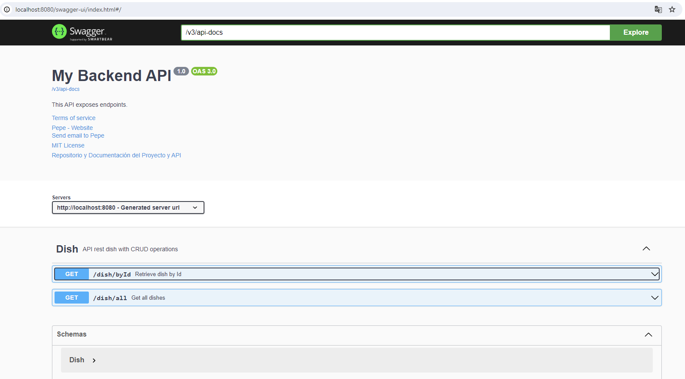
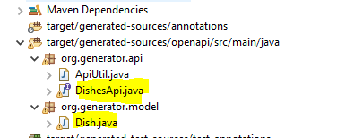

	# Otros
- [Profiles](#profiles)
- [Documentar API Rest](#documentar-api-rest)
	- [Documentar endpoints](#documentar-endpoints)	
- [OpenAPI generator](#openapi-generator)

## Profiles

Dado que las aplicaciones se pueden ejecutar en diferentes entornos(Local, desarrollo, preproducción o producción). La información almacenada en los ficheros .properties puede
variar dependiendo de cada entorno, como por ejemplo: la configuración de acceso a una BBDD, cada entorno tiene su propia BBDD. La nomenclatura del fichero .properties será `application-{nombre_perfil}.properties`

Por ejemplo, en local voy a trabajar con una BBDD H2 y en el entorno de desarrollo se está usando una BBDD postgres.

`application-local.properties`:
```properties
spring.datasource.url=jdbc:h2:mem:testdb;NON_KEYWORDS=pokemon,coach
spring.datasource.driverClassName=org.h2.Driver
spring.datasource.username=sa
spring.datasource.password=
spring.jpa.database-platform=org.hibernate.dialect.H2Dialect

spring.h2.console.path=/h2-console
spring.h2.console.enabled=true
spring.jpa.defer-datasource-initialization=true
```

`application-dev.properties`:
```properties
spring.datasource.url=jdbc:postgresql://10.85.12.1:5432/postgres
spring.datasource.username=root
spring.datasource.password=root
spring.jpa.show-sql=true
spring.jpa.properties.hibernate.dialect = org.hibernate.dialect.PostgreSQLDialect
spring.jpa.hibernate.ddl-auto = none
spring.jpa.defer-datasource-initialization=true
```

Luego en el fichero `application.properties` se define que prefil está activo, además dispondrá de valores comunes que sean los mismos para todos los entornos.
```properties
spring.profiles.active=local
```

## Documentar API Rest

Info -> https://swagger.io/docs/specification/about/

OpenAPI es una especificación para describir APIs REST. Swagger es una herramienta que nos permite generar documentación de APIs REST a partir de la especificación OpenAPI. Para ello, se añadir la dependencia de Swagger en el pom del proyecto.

```xml
<dependency>
    <groupId>org.springdoc</groupId>
    <artifactId>springdoc-openapi-starter-webmvc-ui</artifactId>
    <version>2.1.0</version>
</dependency>
```

Primero se tienen que definir los metadatos de nuestra aplicación, se espeficia información general de la aplicación.

```java
import org.springframework.context.annotation.Bean;
import org.springframework.context.annotation.Configuration;

import io.swagger.v3.oas.models.ExternalDocumentation;
import io.swagger.v3.oas.models.OpenAPI;
import io.swagger.v3.oas.models.info.Contact;
import io.swagger.v3.oas.models.info.Info;
import io.swagger.v3.oas.models.info.License;

@Configuration
public class OpenApiConf {

	@Bean
	OpenAPI myOpenAPI() {
	
		// Se define informacion general del proyecto
		
		Info info = new Info().title("My Backend API").version("1.0").description("This API exposes endpoints.")
				.termsOfService("https://www.ayuda.com/terms")
				.license(new License().name("MIT License").url("https://choosealicense.com/licenses/mit/"))
				.contact(new Contact().email("lobato@gmail.com").name("Pepe").url("https://www.forocoches.com"));

		return new OpenAPI().info(info)
				.externalDocs(new ExternalDocumentation().description("Repositorio y Documentación del Proyecto y API")
						.url("https://github.com/joseluisgs/tenistas-rest-springboot-2022-2023"));
	}

}

```

En este fichero de configuración se puede especificar que controladores Rest se desean documentar, por defecto son todos, pero se podría indicar con GroupedOpenApi.


### Documentar endpoints

Las anotaciones principales para documentar los endpoint del controller son:

- `@Operation`: se documenta lo que hace el método
- `@Parameter`: se documenta los parametros que se reciben
- `@ApiResponse`: Se documenta las respuestas del endpoint

```java

	@Operation(summary = "Get all dishes")
	@ApiResponses({ @ApiResponse(responseCode = "200", description = "List of dishes", content = {
			@Content(mediaType = "application/json", array = @ArraySchema(schema = @Schema(implementation = Dish.class))) }) })
	@GetMapping("/all")
	public ResponseEntity<List<Dish>> getDishes() {


	@Operation(summary = "Retrieve dish by Id")
	@ApiResponses({
			@ApiResponse(responseCode = "200", content = {
					@Content(schema = @Schema(implementation = Dish.class), mediaType = "application/json") }),
			@ApiResponse(responseCode = "204", description = "No found dish by id", content = {
					@Content(schema = @Schema()) }),
			@ApiResponse(responseCode = "500", description = "Error in application", content = { @Content(schema = @Schema()) }) })
	@GetMapping("/dishById")
	@Parameter(name = "dishId", description = "identifier of dish", required = true, example = "1")
	public ResponseEntity<Dish> getDishById(@RequestParam String dishId) {

```


Para dto:   

- `@Schema`: Para documentar cada atributo

Ejemplo:

```java

import io.swagger.v3.oas.annotations.media.Schema;

public class Dish {
	
	@Schema(description = "dish name", example = "Patatas y huevos fritos")
	private String name;
	
	@Schema(description = "dish price", example = "12.1", maxLength = 9999999)
	private double price;
	
	@Schema(description = "Registration date in menu yy-MM-dd", example = "12-12-2012")
	private LocalDate date;
	
	@Schema(description = "Vegeterian dish or not", example = "true")
	private boolean vegetarian;
	
	@Schema(description = "Contains gluten or not", example = "false")
	private boolean gluten;

}

```

Finalmente podemos acceder a la ruta en: http://localhost:XXXX/swagger-ui/index.html (XXXX es el puerto de nuestra aplicación). Por ejemplo: http://localhost:8080/swagger-ui/index.html




Se puede obtener el documento openapi en http://localhost:8080/v3/api-docs. Copia el contenido del fichero en https://editor.swagger.io/ y descarga el fichero con formato .yaml
Usando el patrón API First, este documento es como un contrato de diseño de lo que se va a implemetar, este documento se construye antes de comenzar el desarrollo, lo cual permite al equipo de fronted y backend definir que se necesita. Una vez validado el documento, se comienza con el desarrollo.

Más información en https://swagger.io/docs/specification/basic-structure/

## OpenAPI generator

Partiendo un fichero de definición API(Por ejemplo: openapi.yaml), se puede generar mediante un plugin los dtos y endpoint defindos.
Primer alojar el fichero .yaml en /src/main/resources.

Es necesario tener definidas las siguientes dependencias en el pom.xml


```xml
		<dependency>
		    <groupId>org.projectlombok</groupId>
		    <artifactId>lombok</artifactId>
		</dependency>
		<dependency>
			<groupId>org.springdoc</groupId>
			<artifactId>springdoc-openapi-starter-webmvc-ui</artifactId>
			<version>2.2.0</version>
		</dependency>
		<dependency>
			<groupId>org.openapitools</groupId>
			<artifactId>jackson-databind-nullable</artifactId>
			<version>0.2.2</version>
		</dependency>
```

Además del siguiente plugin

```xml
<plugin>
	<groupId>org.openapitools</groupId>
	<artifactId>openapi-generator-maven-plugin</artifactId>
	<version>7.1.0</version>
	<executions>
		<execution>
			<goals>
				<goal>generate</goal>
			</goals>
			<configuration>
				<inputSpec>
					${project.basedir}/src/main/resources/openapi.yaml
				</inputSpec>
				<generatorName>spring</generatorName>
				<apiPackage>org.generator.api</apiPackage>
				<modelPackage>org.generator.model</modelPackage>
				<configOptions>
				    <additionalModelTypeAnnotations>@lombok.Data @lombok.NoArgsConstructor @lombok.AllArgsConstructor @lombok.Builder</additionalModelTypeAnnotations>
					<interfaceOnly>true</interfaceOnly>
					<library>spring-boot</library>
						<oas3>true</oas3>
						<useSpringController>true</useSpringController>
						<useSpringBoot3>true</useSpringBoot3>
						<useSpringfox>false</useSpringfox>
					</configOptions>
				</configuration>
			</execution>
	</executions>
</plugin>


```

Ejecuta el comando mvn install para que se generen la clases, observa que en targer se han generado los endpoint(Api) y su correspondiente DTO.

 
 

A partir de ahora se puede definir un controlador que implemente DishesApi, crea un nuevo controlador que implemente dicha clase y sobreescriba sus métodos.


```java

import org.generator.api.DishesApi;
import org.generator.model.Dish;
import org.springframework.http.ResponseEntity;
import org.springframework.web.bind.annotation.RestController;

import jakarta.validation.Valid;
import jakarta.validation.constraints.NotNull;

@RestController
public class DishController implements DishesApi {
	
	@Override
	public ResponseEntity<List<Dish>> getDishes() {
		// TODO Auto-generated method stub
		return DishesApi.super.getDishes();
	}
	
	@Override
	public ResponseEntity<Dish> getDishById(@NotNull @Valid String dishId) {
		// TODO Auto-generated method stub
		return DishesApi.super.getDishById(dishId);
	}
}

```
Arranca la aplicación y accede a swagger.


