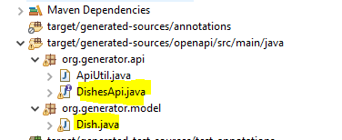

# Otros
- [Profiles](#profiles)
- [Logger](#logger)
- [Documentar API Rest](#documentar-api-rest)
	- [Documentar endpoints](#documentar-endpoints)	
- [OpenAPI generator](#openapi-generator)
- [MapStruct](#mapstruct)
- [Java Streams](#java-streams)

## Profiles
Dado que las aplicaciones se pueden ejecutar en diferentes entornos(Local, desarrollo, preproducción o producción). La información almacenada en los ficheros .properties puede
variar dependiendo de cada entorno, como por ejemplo: la configuración de acceso a una BBDD, cada entorno tiene su propia BBDD. La nomenclatura del fichero .properties será `application-{nombre_perfil}.properties`

Por ejemplo, en local voy a trabajar con una BBDD H2 y en el entorno de desarrollo se está usando una BBDD postgres.
`application-local.properties`:
```properties
spring.datasource.url=jdbc:h2:mem:testdb;NON_KEYWORDS=pokemon,coach
spring.datasource.driverClassName=org.h2.Driver
spring.datasource.username=sa
spring.datasource.password=
spring.jpa.database-platform=org.hibernate.dialect.H2Dialect

spring.h2.console.path=/h2-console
spring.h2.console.enabled=true
spring.jpa.defer-datasource-initialization=true
```

`application-dev.properties`:
```properties
spring.datasource.url=jdbc:postgresql://10.85.12.1:5432/postgres
spring.datasource.username=root
spring.datasource.password=root
spring.jpa.show-sql=true
spring.jpa.properties.hibernate.dialect = org.hibernate.dialect.PostgreSQLDialect
spring.jpa.hibernate.ddl-auto = none
spring.jpa.defer-datasource-initialization=true
```

Luego en el fichero `application.properties` se define que prefil está activo, además dispondrá de valores comunes que sean los mismos para todos los entornos.
```properties
spring.profiles.active=local
```

## Logger

El registro (logging) es una parte crucial de cualquier aplicación, ya que permite a los desarrolladores rastrear la ejecución de la aplicación, depurar problemas y monitorear el comportamiento del sistema. Spring Boot facilita la configuración y el uso de loggers mediante la integración con varias bibliotecas de registro populares como Logback, Log4j2 y Java Util Logging (JUL).

### Configuración de Logback (predeterminado)

Spring Boot usa Logback como la implementación de registro predeterminada. No se requiere ninguna configuración adicional para comenzar a usar Logback, ya que viene preconfigurado con Spring Boot Starter.

### Uso del Logger en tu Código

Para usar el logger en tus clases de Spring Boot, puedes seguir estos pasos:

### Inyección del Logger

Spring Boot recomienda el uso de SLF4J (Simple Logging Facade for Java) como una abstracción de registro. Aquí hay un ejemplo de cómo inyectar y usar el logger en una clase:

```java
import org.slf4j.Logger;
import org.slf4j.LoggerFactory;
import org.springframework.stereotype.Service;

@Service
public class MyService {

    private static final Logger logger = LoggerFactory.getLogger(MyService.class);

    public void performTask() {
        logger.info("Starting task");
        try {
            // Lógica del negocio
        } catch (Exception e) {
            logger.error("Error occurred while performing task", e);
        }
        logger.info("Task completed");
    }
}
```

### Niveles de Registro

SLF4J soporta varios niveles de registro:

- `TRACE`: Información de traza detallada.
- `DEBUG`: Información de depuración.
- `INFO`: Información general.
- `WARN`: Advertencias que podrían no ser críticas.
- `ERROR`: Errores que requieren atención.

### Configuración de Niveles de Registro

Puedes configurar los niveles de registro para diferentes paquetes o clases en el archivo `application.properties` o `application.yml`.

#### Usando `application.properties`

```properties
logging.level.root=INFO
logging.level.com.example.myapp=DEBUG
```

#### Usando `application.yml`

```yaml
logging:
  level:
    root: INFO
    com.example.myapp: DEBUG
```

### Creación de un Archivo de Log

Para crear y configurar un archivo de log, puedes modificar el archivo `application.properties` o `application.yml` de la siguiente manera:

#### Usando `application.properties`

```properties
logging.file.name=application.log
```

#### Usando `application.yml`

```yaml
logging:
  file:
    name: application.log
```

Estos ajustes configurarán Spring Boot para que cree un archivo de log llamado `application.log` en el directorio predeterminado.

## Documentar API Rest

Info -> https://swagger.io/docs/specification/about/

OpenAPI es una especificación para describir APIs REST. Swagger es una herramienta que nos permite generar documentación de APIs REST a partir de la especificación OpenAPI. Para ello, se añadir la dependencia de Swagger en el pom del proyecto.

```xml
<dependency>
    <groupId>org.springdoc</groupId>
    <artifactId>springdoc-openapi-starter-webmvc-ui</artifactId>
    <version>2.8.4</version>
</dependency>
```

Primero se tienen que definir los metadatos de nuestra aplicación, se espeficia información general de la aplicación.

```java
import org.springframework.context.annotation.Bean;
import org.springframework.context.annotation.Configuration;

import io.swagger.v3.oas.models.ExternalDocumentation;
import io.swagger.v3.oas.models.OpenAPI;
import io.swagger.v3.oas.models.info.Contact;
import io.swagger.v3.oas.models.info.Info;
import io.swagger.v3.oas.models.info.License;

@Configuration
public class OpenApiConf {

	@Bean
	OpenAPI myOpenAPI() {
	
		// Se define informacion general del proyecto
		
		Info info = new Info().title("My Backend API").version("1.0").description("This API exposes endpoints.")
				.termsOfService("https://www.ayuda.com/terms")
				.license(new License().name("MIT License").url("https://choosealicense.com/licenses/mit/"))
				.contact(new Contact().email("lobato@gmail.com").name("Pepe").url("https://www.forocoches.com"));

		return new OpenAPI().info(info)
				.externalDocs(new ExternalDocumentation().description("Repositorio y Documentación del Proyecto y API")
						.url("https://github.com/joseluisgs/tenistas-rest-springboot-2022-2023"));
	}

}

```

En este fichero de configuración se puede especificar que controladores Rest se desean documentar, por defecto son todos, pero se podría indicar con GroupedOpenApi.


### Documentar endpoints

Las anotaciones principales para documentar los endpoint del controller son:

- `@Operation`: se documenta lo que hace el método
- `@Parameter`: se documenta los parametros que se reciben
- `@ApiResponse`: Se documenta las respuestas del endpoint

```java

	@Operation(summary = "Get all dishes")
	@ApiResponses({ @ApiResponse(responseCode = "200", description = "List of dishes", content = {
			@Content(mediaType = "application/json", array = @ArraySchema(schema = @Schema(implementation = Dish.class))) }) })
	@GetMapping("/all")
	public ResponseEntity<List<Dish>> getDishes() {


	@Operation(summary = "Retrieve dish by Id")
	@ApiResponses({
			@ApiResponse(responseCode = "200", content = {
					@Content(schema = @Schema(implementation = Dish.class), mediaType = "application/json") }),
			@ApiResponse(responseCode = "204", description = "No found dish by id", content = {
					@Content(schema = @Schema()) }),
			@ApiResponse(responseCode = "500", description = "Error in application", content = { @Content(schema = @Schema()) }) })
	@GetMapping("/dishById")
	@Parameter(name = "dishId", description = "identifier of dish", required = true, example = "1")
	public ResponseEntity<Dish> getDishById(@RequestParam String dishId) {

```


Para dto:   

- `@Schema`: Para documentar cada atributo

Ejemplo:

```java

import io.swagger.v3.oas.annotations.media.Schema;

public class Dish {
	
	@Schema(description = "dish name", example = "Patatas y huevos fritos")
	private String name;
	
	@Schema(description = "dish price", example = "12.1", maxLength = 9999999)
	private double price;
	
	@Schema(description = "Registration date in menu yy-MM-dd", example = "12-12-2012")
	private LocalDate date;
	
	@Schema(description = "Vegeterian dish or not", example = "true")
	private boolean vegetarian;
	
	@Schema(description = "Contains gluten or not", example = "false")
	private boolean gluten;

}

```

Finalmente podemos acceder a la ruta en: http://localhost:XXXX/swagger-ui/index.html (XXXX es el puerto de nuestra aplicación). Por ejemplo: http://localhost:8080/swagger-ui/index.html


Se puede obtener el documento openapi en http://localhost:8080/v3/api-docs. Copia el contenido del fichero en https://editor.swagger.io/ y descarga el fichero con formato .yaml
Usando el patrón API First, este documento es como un contrato de diseño de lo que se va a implemetar, este documento se construye antes de comenzar el desarrollo, lo cual permite al equipo de fronted y backend definir que se necesita. Una vez validado el documento, se comienza con el desarrollo.

Más información en https://swagger.io/docs/specification/basic-structure/

## OpenAPI generator

Partiendo un fichero de definición API(Por ejemplo: openapi.yaml), se puede generar mediante un plugin los dtos y endpoint defindos.
Primer alojar el fichero .yaml en /src/main/resources.

Es necesario tener definidas las siguientes dependencias en el pom.xml


```xml
		<dependency>
		    <groupId>org.projectlombok</groupId>
		    <artifactId>lombok</artifactId>
		</dependency>
		<dependency>
			<groupId>org.springdoc</groupId>
			<artifactId>springdoc-openapi-starter-webmvc-ui</artifactId>
			<version>2.2.0</version>
		</dependency>
		<dependency>
			<groupId>org.openapitools</groupId>
			<artifactId>jackson-databind-nullable</artifactId>
			<version>0.2.2</version>
		</dependency>
```

Además del siguiente plugin

```xml
<plugin>
	<groupId>org.openapitools</groupId>
	<artifactId>openapi-generator-maven-plugin</artifactId>
	<version>7.1.0</version>
	<executions>
		<execution>
			<goals>
				<goal>generate</goal>
			</goals>
			<configuration>
				<inputSpec>
					${project.basedir}/src/main/resources/openapi.yaml
				</inputSpec>
				<generatorName>spring</generatorName>
				<apiPackage>org.generator.api</apiPackage>
				<modelPackage>org.generator.model</modelPackage>
				<configOptions>
				    <additionalModelTypeAnnotations>@lombok.Data @lombok.NoArgsConstructor @lombok.AllArgsConstructor @lombok.Builder</additionalModelTypeAnnotations>
					<interfaceOnly>true</interfaceOnly>
					<library>spring-boot</library>
						<oas3>true</oas3>
						<useSpringController>true</useSpringController>
						<useSpringBoot3>true</useSpringBoot3>
						<useSpringfox>false</useSpringfox>
					</configOptions>
				</configuration>
			</execution>
	</executions>
</plugin>


```

Ejecuta el comando mvn install para que se generen la clases, observa que en target se han generado los endpoint(Api) y su correspondiente DTO.

 
 

A partir de ahora se puede definir un controlador que implemente DishesApi, crea un nuevo controlador que implemente dicha clase y sobreescriba sus métodos.


```java

import org.generator.api.DishesApi;
import org.generator.model.Dish;
import org.springframework.http.ResponseEntity;
import org.springframework.web.bind.annotation.RestController;

import jakarta.validation.Valid;
import jakarta.validation.constraints.NotNull;

@RestController
public class DishController implements DishesApi {
	
	@Override
	public ResponseEntity<List<Dish>> getDishes() {
		// TODO Auto-generated method stub
		return DishesApi.super.getDishes();
	}
	
	@Override
	public ResponseEntity<Dish> getDishById(@NotNull @Valid String dishId) {
		// TODO Auto-generated method stub
		return DishesApi.super.getDishById(dishId);
	}
}

```
Arranca la aplicación y accede a swagger.

## MapStruct

MapStruct es una herramienta de generación de código en Java que simplifica la implementación de mapeos entre objetos de diferentes tipos, especialmente en aplicaciones Spring Boot. Su principal objetivo es reducir la cantidad de código repetitivo y propenso a errores que se escribe manualmente para convertir datos entre entidades, DTOs (Data Transfer Objects) y otros modelos.

MapStruct genera automáticamente clases de mapeo en tiempo de compilación, lo que garantiza un alto rendimiento y seguridad de tipos. Además, se integra perfectamente con Spring Boot, permitiendo inyectar los mapeadores generados como beans de Spring. Esto lo convierte en una opción ideal para aplicaciones que requieren una gestión eficiente y limpia de transformaciones de datos.

```xml
		<dependency>
			<groupId>org.mapstruct</groupId>
			<artifactId>mapstruct</artifactId>
			<version>1.6.3</version>
		</dependency>
```

Para que la compilación del proyecto se ejecute de formar correcta, hace falta añadir/modificar el plugin maven-compiler-plugin
que se encarga de procesar las anotaciones de lombok y mapstruct para generar el código final.

```xml
<plugin>
  <groupId>org.apache.maven.plugins</groupId>
  <artifactId>maven-compiler-plugin</artifactId>
  <configuration>
    <annotationProcessorPaths>
      <path>
        <groupId>org.projectlombok</groupId>
        <artifactId>lombok</artifactId>
        <version>${lombok.version}</version>
      </path>
      <path>
        <groupId>org.mapstruct</groupId>
        <artifactId>mapstruct-processor</artifactId>
        <version>1.6.3</version>
      </path>
      <path>
        <groupId>org.projectlombok</groupId>
        <artifactId>lombok-mapstruct-binding</artifactId>
        <version>0.2.0</version>
      </path>
    </annotationProcessorPaths>
  </configuration>
</plugin>
```

 **Lombok-MapStruct-Binding**: Proporciona integración entre Lombok y MapStruct, permitiendo que ambos trabajen juntos sin problemas, porque mapstruct necesita usar los métodos de clases y necesita que se genere previamente antes de generar la implementación del mapper.

```java
	@Mapper(componentModel = "spring")
	public interface ProductMapper {
		ProductDTO productToProductDTO(Product product);
		Product productDTOToProduct(ProductDTO productDTO);
	}
```

En el caso de los nombres de los atributos en las clases sean diferente, hay que especificar justo encima de la definición, la correlación de los campos.

```java
	@Mapping(source = "fullName", target = "name")
	@Mapping(source = "emailAddress", target = "email")
	EmployeeDTO employeeToEmployeeDTO(Employee employee);
```

Además si se necesita reutilzar un mapper, dado que una clase que contiene un atributo de otra clase, se tiene que especificar el mapper del atributo contenido.

```java
@Mapper(componentModel = "spring", uses = PlayerMapper.class)
public interface TournamentMapper
```

Realizar una **maven install** del proyecto, observar la carpeta **target**, en generated-source, se encuentra la implementación del mapper.


## Java Streams

Tutorial inicial -> https://medium.com/be-tech-with-santander/programaci%C3%B3n-en-java-java-stream-para-dummies-428258c03688

### ¿Qué son los Streams y qué aportan?
Los Streams fueron introducidos en **Java 8** para proporcionar una forma más funcional y declarativa de procesar datos. Permiten a los desarrolladores escribir código conciso y expresivo para manipular colecciones de datos mediante una serie de operaciones que pueden ser paralelizadas fácilmente para mejorar el rendimiento.

### Ventajas de usar Streams:
- **Declarativo**: Permiten describir el _qué_ hacer con los datos en lugar del _cómo_ hacerlo.
- **Conciso**: Reducen la cantidad de código comparado con los enfoques imperativos.
- **Paralelización**: Facilitan la paralelización de operaciones para mejorar el rendimiento.
- **Legibilidad**: Hacen que el código sea más fácil de leer y mantener.

### Elementos de Entrada, Intermedios y Terminales
- **Entrada**: La fuente de datos que debe ser una colección.
- **Operaciones Intermedias**: Transforman la secuencia de elementos y devuelven otro Stream.
- **Operaciones Finales**: Procesan el Stream y devuelven un resultado o efecto secundario.

### Ejemplo de Uso Imperativo vs. Uso con Streams

- **forEach**: Aplica una acción a cada elemento del Stream. Es una operación terminal que no devuelve ningún resultado, solo ejecuta la acción especificada para cada elemento. Ejemplo:

	**Imperativo:**
- 
	```java
	List<String> names = Arrays.asList("Alice", "Bob", "Charlie", "David");
		for (String name : names) {
			System.out.println(name);
		}
	```
	
	**Stream:**
	```java
	List<String> names = Arrays.asList("Alice", "Bob", "Charlie", "David");
	names.stream().forEach(System.out::println);
	```
- **Count**:
- **AnyMatch**:
- **Collect**:

#### Ejemplo con `filter` y `map`

**Imperativo:**

```java
List<String> names = Arrays.asList("Alice", "Bob", "Charlie", "David");
List<String> filteredNames = new ArrayList<>();
for (String name : names) {
    if (name.startsWith("A")) {
        filteredNames.add(name.toUpperCase());
    }
}
System.out.println(filteredNames); // [ALICE]
```


